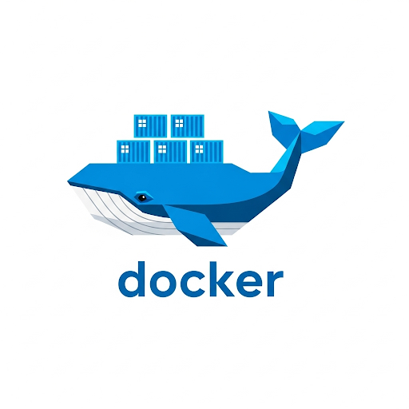
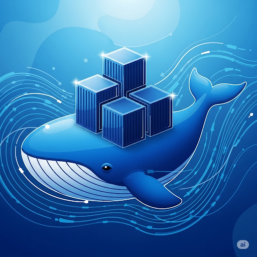
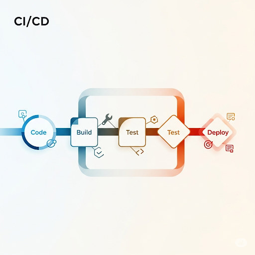

# SmartPOS


[](https://angular.io/)
[](https://spring.io/projects/spring-boot)
[](https://www.h2database.com/)
[](https://www.docker.com/)
[](https://github.com/features/actions)

## 🚀 Introduction

SmartPOS is a lightweight, fast, and intuitive Point of Sale system designed for modern businesses. Built with Angular frontend and Spring Boot microservices backend, SmartPOS provides a comprehensive solution for retail operations.

### Key Features

- **📦 Product Management**: Complete product catalog with inventory tracking
- **🛒 Order Processing**: Streamlined order creation and management
- **💳 Payment Handling**: Secure payment processing and transaction management
- **📊 Inventory Control**: Real-time inventory tracking and stock management
- **🔍 Product Query**: Advanced search and filtering capabilities
- **📈 Basic Reporting**: Sales analytics and business insights

## 🛠️ Tech Stack

- **Frontend**: Angular with TypeScript
- **Backend**: Spring Boot microservices architecture
- **Database**: H2 in-memory database
- **Service Discovery**: Eureka Server
- **API Gateway**: Spring Cloud Gateway
- **Configuration**: Spring Cloud Config Server
- **Containerization**: Docker & Docker Hub
- **CI/CD**: GitHub Actions

## 📋 Prerequisites

Before running SmartPOS, ensure you have the following installed:

- Java 17 or higher
- Node.js 16+ and npm
- Docker and Docker Compose
- Git

## 🚀 Installation & Setup

### 1. Clone the Repository

```bash
git clone https://github.com/kam-stand/SmartPOS.git
cd SmartPOS
```

### 2. Backend Services (Microservices)

```bash
cd micro-services

# Build all services
chmod -x ./build-microservices.sh

./build-microservices.sh

# Run with Docker Compose
docker-compose up -d
```

### 3. Frontend Application

```bash
cd smart-pos-frontend

# Install dependencies
npm install

# Start development server
npm start
```

The application will be available at:

- Frontend: `http://localhost:4200`
- API Gateway: `http://localhost:8080`
- Eureka Server: `http://localhost:8761`

## 🐳 Docker & Containerization



SmartPOS is fully containerized using Docker for easy deployment and scalability. The latest frontend UI and configuration server are deployed and containerized, ensuring consistent environments across development, testing, and production.

### Docker Installation

To run SmartPOS using Docker, you need to have Docker installed on your system:

**Download and Install Docker**: [https://docs.docker.com/get-docker/](https://docs.docker.com/get-docker/)

Follow the installation guide for your operating system (Windows, macOS, or Linux).

### Running from Docker Hub



Pre-built Docker images are available on Docker Hub for quick deployment:

```bash
# Pull and run the Angular Frontend
docker pull kamhassan/smartpos-angular:latest-d483f1f
docker run -p 4200:80 kamhassan/smartpos-angular:latest-d483f1f

# Pull and run the Config Server
docker pull kamhassan/smartpos-configserver:latest-d483f1f
docker run -p 8888:8888 kamhassan/smartpos-configserver:latest-d483f1f
```

All Docker images are available on Docker Hub for easy access and deployment. The containerized approach provides:

- **Consistent Deployment**: Same environment across all stages
- **Easy Scaling**: Horizontal scaling of microservices
- **Simplified Management**: Container orchestration with Docker Compose

## 🔄 CI/CD Pipeline


SmartPOS uses GitHub Actions for continuous integration and continuous deployment, ensuring code quality and automated deployments.



The CI/CD pipeline includes:

- **Automated Testing**: Unit and integration tests on every commit
- **Code Quality Checks**: Static analysis and linting
- **Docker Image Building**: Automated container image creation
- **Deployment**: Automatic deployment to staging and production environments

## 🏗️ Architecture

SmartPOS follows a microservices architecture pattern:

- **API Gateway**: Single entry point for all client requests
- **Config Server**: Centralized configuration management
- **Eureka Server**: Service discovery and registration
- **Product Service**: Product catalog and management
- **Inventory Service**: Stock tracking and management
- **Order Service**: Order processing and management
- **Payment Service**: Payment processing and transaction handling

## 🤝 Contributing

We welcome contributions to SmartPOS! Please follow these steps:

1. Fork the repository
2. Create a feature branch (`git checkout -b feature/amazing-feature`)
3. Commit your changes (`git commit -m 'Add some amazing feature'`)
4. Push to the branch (`git push origin feature/amazing-feature`)
5. Open a Pull Request

## 📧 Contact

For questions, suggestions, or support, please reach out:

**Email**: [kh84590@gmail.com](mailto:kh84590@gmail.com)

## 📄 License

This project is licensed under the MIT License - see the [LICENSE](LICENSE) file for details.

---

⭐ If you find SmartPOS helpful, please give it a star on GitHub!
